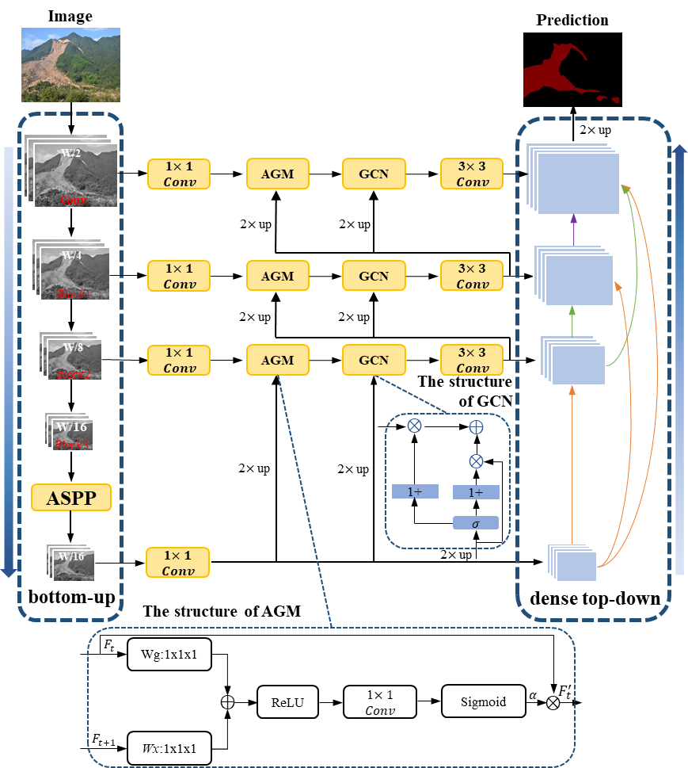
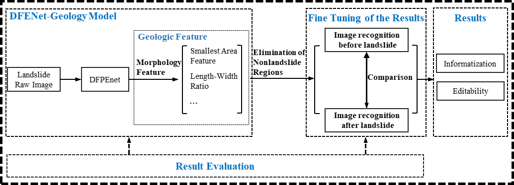

# DFPENet

#Evaluation the model on the ISPRS Vaihingen dataset
| Imp. Surf.	| Build. | Low veg. | Tree |	Car |	Mean | F1 |	mIoU |	OA
| ---------- | :-----------:  | :-----------: | :-----------: | :-----------: | :-----------: | :-----------: | :-----------: | :-----------: |
| [DFPENet](https://pan.baidu.com/s/17Iei_F87qQZPl9yjv8vNXQ)     | 89.79	| 93.52  |	79.32  |	86.67  |	77.99  |	85.46  |	75.10  |	87.61  |
| [DFPENet+Pre-trained Datasets](https://pan.baidu.com/s/1ZExwMqggLb33FJ7V-AtluQ) 	| 92.77 |	95.53 |	86.38 |	90.71 |	81.17 |	89.31 |	81.06 |	91.38 |

# DFPENet-geology

#The proposed scheme is applied to two earthquake-triggered landslides in Jiuzhaigou (China) and Hokkaido (Japan)
#[The scheme evaluated on the earthquake-triggered Jiuzhaigou landslides](https://pan.baidu.com/s/1KeFKTCDff1nSmRqAfI286A)
| Category | Precision | Recall | mIoU (Accuracy) |
| ---------- | :-----------:  | :-----------: | :-----------: |
| Validation set | 91.09% | 91.46% | 83.95% |
| Final results | 99.97% | 98.70% |	98.67% |

#[The transfer learning scheme evaluated on the earthquake-triggered Hokkaido landslides](https://pan.baidu.com/s/1lEkSMMe7RmHgwRAFTyHi1g)
| Category | Precision | Recall | mIoU (Accuracy) |
| ---------- | :-----------:  | :-----------: | :-----------: |
| Validation set |84.28% | 90.20% |	77.21% |

# Utilizing our schemes to accomplish recognition tasks for other seismic landslides is highly welcomed.
